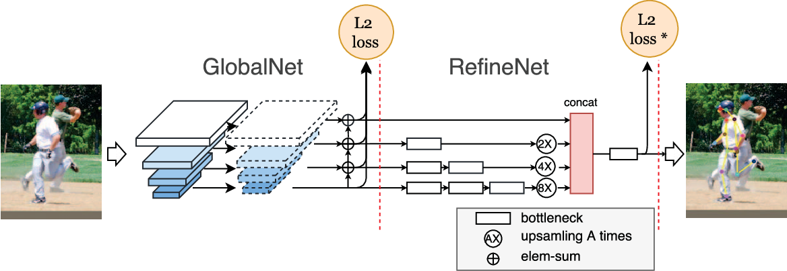
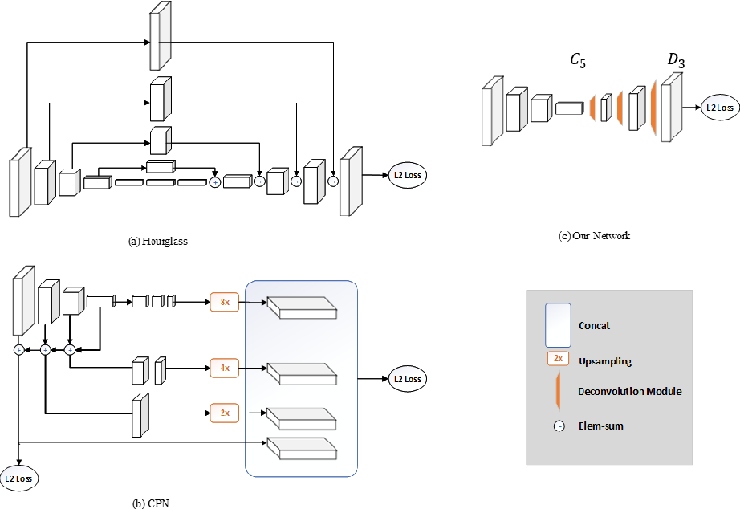
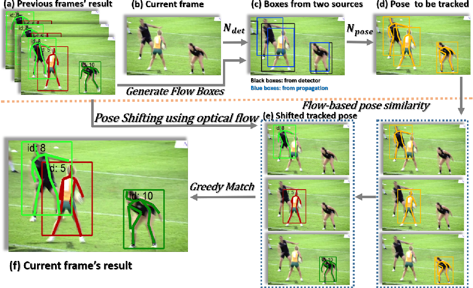

Recent Models on Pose Estimation
===

1. References
  - Pose Estimation: [https://paperswithcode.com/task/pose-estimation](https://paperswithcode.com/task/pose-estimation)
  - Multi-Person Pose Estimation: [https://paperswithcode.com/task/multi-person-pose-estimation](https://paperswithcode.com/task/multi-person-pose-estimation)
  - Keypoint Detection: [https://paperswithcode.com/task/keypoint-detection](https://paperswithcode.com/task/keypoint-detection)

2. Recently published, but no codes (21, Nov, 2019)
  - Cascade Feature Aggregation (2019)
  - DarkPose (2019, repository exsists but not ready)
  - Spacial Contextual Information (2019)

3. To understand pose estimation models, we need to know sub tasks of pose estimation. Mostly these are mixed, but some of models focused on specific task.
  - Single / Multi person pose estimation
  - Keypoint detection (COCO Keypoint Detection Challenge)
  - Pose tracking (PoseTrack Challenge)
  - Refinement pose estimation

AlphaPose(RMPE's New Version) (2016)
---
**"RMPE: Regional Multi-person Pose Estimation"**

[[Paper Link]](https://arxiv.org/abs/1612.00137v5)
[[Code Link]](https://github.com/MVIG-SJTU/AlphaPose)
 
Ref: [Spatial Transformer Network](https://jamiekang.github.io/2017/05/27/spatial-transformer-networks/)

 

 

- SPPE: Single Person Pose Estimator
- SSTN: Symmetric Spatial Transformer Network
- p-Pose NMS: Parametric Pose Non-Maximum-Suppression
- PGPG: Pose-Guided Proposals Generator

 
RMPE는 기본적으로 human detector를 통해 region proposal을 수행한 뒤, 각각의 region에서 SPPE를 적용해 pose를 추출해내는 two-step framework 이다. human detector와 SPPE는 기존의 다양한 방법들을 사용할 수 있고, 실제 테스트로 faster-rcnn (human detector)과 stacked hourglass model (SSPE)를 사용하였다.

RMPE는 two-step framework 방식과 part-based framework 방식 중 전자의 경우, 첫번째로 수행하는 human detector의 region 결과에 따라 pose estimation 정확도에 영향을 끼친다고 주장한다. 이는 localization error와 redundant detection problem을 야기하며 이를 SSTN과 p-Pose NMS를 통해 해결할 수 있음을 보였다.

Cascaded Pyramid Network(CPN+) (2017)
---
**"Cascaded Pyramid Network for Multi-Person Pose Estimation"**

[[Paper Link]](https://arxiv.org/abs/1711.07319v2)
[[Code Link]](https://github.com/chenyilun95/tf-cpn)

SimplePose(ResNet) (2018)
---
**"Simple Baselines for Human Pose Estimation and Tracking"**

[[Paper Link]](https://arxiv.org/abs/1804.06208v2)
[[Code Link]](https://github.com/Microsoft/human-pose-estimation.pytorch)

HRNet (2019)
---
**"Deep High-Resolution Representation Learning for Human Pose Estimation"**

[[Paper Link]](https://arxiv.org/abs/1902.09212v1)
[[Code Link]](https://github.com/leoxiaobin/deep-high-resolution-net.pytorch)

